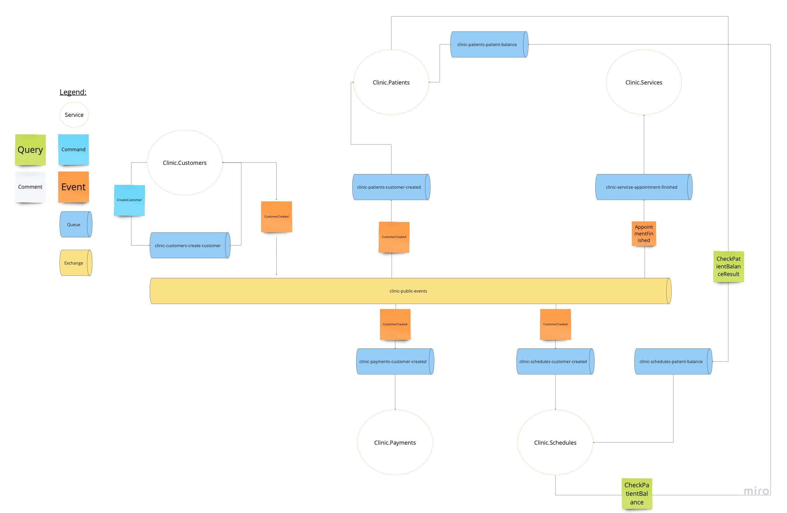

# Introduction to asynchronous communication patterns 

That solution has been development as a part of bITconf 2022 conference.

# Architecture diagram

# Related resources

-[Enterprise integration patterns website](https://www.enterpriseintegrationpatterns.com/)
-[About change authonomy in microservices architecture (PL)](https://bettersoftwaredesign.pl/episodes/34) 
-[Sample repositorie made by me with more UI](https://github.com/rafalpienkowski/integration-patterns)
